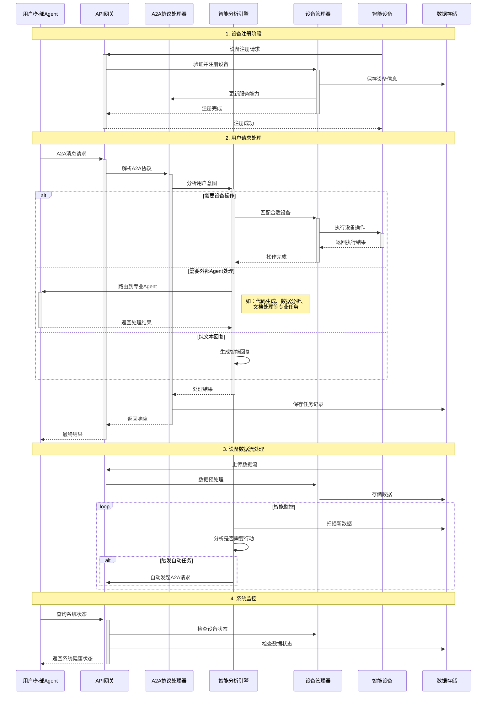
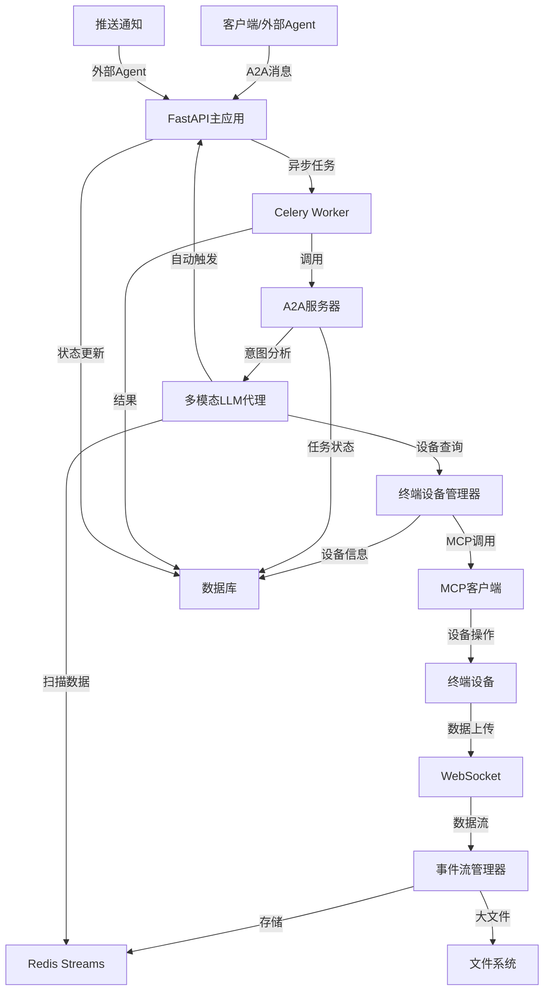

# A2A终端设备代理服务 - 详细时序图

## 服务讲解稿 - 面向技术新手

### 什么是A2A终端设备代理服务？

大家好，今天我要为大家介绍一个智能的**A2A终端设备代理服务**。

**首先，让我们理解几个核心概念：**

#### 1. 什么是A2A协议？
- **A2A** = Agent-to-Agent（代理到代理）
- 这是一个标准的通信协议，让不同的AI代理之间可以互相对话和协作
- 就像人与人之间有语言交流，AI代理之间也需要一套"语言"来沟通

####    participant Cli    participant ESM as 事件流管理器<br/>(event_stream_manager.py)
    participant Redis as Redis Streams<br/>(数据流存储)
    participant DB as 数据库<br/>(SQLite/PostgreSQL)
    participant MCP as MCP客户端<br/>(mcp_client.py)
    participant Device as 终端设备<br/>(摄像头/传感器等) 客户端/外部Agent
    participant API as FastAPI主应用<br/>(main_simple.py)
    participant Auth as 认证中间件<br/>(HTTPBearer)
    participant A2AServer as A2A服务器<br/>(zhipu_a2a_server.py)
    participant TaskQueue as Celery任务队列<br/>(tasks.py)
    participant Worker as Celery Worker<br/>(worker_manager.py)
    participant TDM as 终端设备管理器<br/>(terminal_device_manager.py)
    participant LLM as 多模态LLM代理<br/>(multimodal_llm_agent.py)
    participant ESM as 事件流管理器<br/>(event_stream_manager.py)
    participant Redis as Redis Streams<br/>(数据流存储)
    participant DB as 数据库<br/>(SQLite/PostgreSQL)
    participant MCP as MCP客户端<br/>(mcp_client.py)
    participant Device as 终端设备<br/>(摄像头/传感器等)- 指各种智能设备：摄像头、传感器、机器人、IoT设备等
- 这些设备有自己的功能（拍照、测温、移动等），但需要"大脑"来协调

#### 3. 我们的服务做什么？
我们的服务就是这个"大脑"，它的作用是：
- **连接** 各种智能设备
- **理解** 用户的需求
- **智能分派** 任务给合适的设备
- **协调** 多个设备协同工作

### 核心功能解析

#### 功能1：设备管理 - "设备户口本"
```
想象一下：
- 每个智能设备来到我们系统，都要先"登记注册"
- 系统会记录：这个设备叫什么名字？能做什么？怎么联系它？
- 就像给每个设备建立一个"身份档案"
```

#### 功能2：智能意图识别 - "AI秘书"
```
当用户说："帮我拍张照片"
系统会思考：
1. 用户想要什么？ → 拍照
2. 哪个设备能做？ → 摄像头设备
3. 怎么执行？ → 调用摄像头的拍照功能
```

#### 功能3：任务协调 - "交通指挥员"
```
复杂任务例子："监控办公室安全"
系统会协调：
- 摄像头：负责拍摄画面
- 传感器：检测异常
- 报警器：发现问题时报警
- 所有设备配合完成一个大任务
```

#### 功能4：数据流管理 - "智能仓库"
```
设备会产生大量数据：
- 文本数据：传感器读数
- 图片数据：摄像头照片  
- 文件数据：设备日志
系统像仓库管理员，分类存储这些数据
```

### 系统如何工作？ - 用生活化类比

#### 类比1：智能家居管家系统
```
把我们的服务想象成一个超级智能的家居管家：

1. 设备注册 = 新家电入住登记
   - 新买的智能音箱、扫地机器人要先"报到"
   - 管家记录：它们在哪个房间、有什么功能

2. 用户请求 = 主人下达指令
   - 主人说："我要听音乐" 
   - 管家理解并找到音箱执行

3. 智能协调 = 多设备配合
   - 主人说："我要休息了"
   - 管家协调：关灯、调温度、播放轻音乐
```

#### 类比2：企业办公系统
```
我们的服务就像一个企业的智能助理：

1. 员工管理 = 设备管理
   - 每个员工（设备）有自己的技能
   - 系统知道谁会什么，在哪个部门

2. 任务分派 = 智能路由
   - 老板（用户）说要做个项目
   - 助理分析需要哪些技能，派给合适的员工

3. 进度跟踪 = 任务状态管理
   - 实时了解每个任务的完成情况
```

### 技术架构 - 分层理解

#### 第1层：用户接口层（前台接待）
- **FastAPI主应用**：就像公司前台，接待所有来访者
- **认证系统**：验证身份，确保安全

#### 第2层：业务逻辑层（各部门经理）
- **A2A服务器**：翻译官，把A2A语言转成内部语言
- **设备管理器**：设备部门经理，管理所有设备
- **LLM代理**：智能分析师，理解用户意图

#### 第3层：任务执行层（具体执行者）
- **异步任务队列**：任务分发中心，避免拥堵
- **Worker进程**：具体干活的员工

#### 第4层：数据存储层（档案室和仓库）
- **数据库**：重要档案室，存储设备信息、任务记录
- **Redis**：临时仓库，存储实时数据流

#### 第5层：外部接口层（合作伙伴）
- **MCP客户端**：与设备沟通的桥梁
- **LLM服务**：外部智能顾问（GPT、智谱AI等）

### 实际工作流程演示

#### 场景：办公室智能监控
```
第1步：设备准备
- 办公室安装了3个摄像头
- 每个摄像头都注册到我们的系统
- 系统记录：位置、功能、联系方式

第2步：用户需求
- 用户通过API发送：「监控办公室，发现异常立即通知」

第3步：系统分析
- LLM分析：用户要做安全监控
- 查找设备：找到3个摄像头都有监控能力
- 制定计划：启动所有摄像头，开启异常检测

第4步：任务执行
- 分别给3个摄像头发送指令
- 摄像头开始实时拍摄和分析
- 数据流实时传输到系统

第5步：智能处理
- 系统实时分析视频流
- AI检测是否有异常情况
- 发现问题自动发送通知

第6步：结果反馈
- 用户可以随时查询监控状态
- 收到异常报警时获得详细信息
```

### 核心优势

#### 1. 异步处理 - "多线程工作"
- 不会因为一个任务卡住而影响其他任务
- 就像办公室有多个员工同时工作

#### 2. 智能路由 - "最佳人选"
- 根据任务特点选择最合适的设备
- 就像项目经理选择最合适的团队成员

#### 3. 自动化 - "主动服务"
- 系统会主动分析设备数据
- 发现需要处理的情况自动执行
- 就像智能助理会主动提醒重要事项

#### 4. 高可用性 - "永不停机"
- 有备用方案，设备故障不影响整体
- 就像医院有多个医生，一个忙其他人顶上

### 实际应用场景

#### 1. 智能办公
- 会议室预定、环境调节、设备控制
- 「今天下午要开会」→ 自动预订会议室、调节温度、准备投影仪

#### 2. 工厂自动化
- 生产线监控、质量检测、设备维护
- 「检查产品质量」→ 启动检测设备、分析数据、生成报告

#### 3. 智能家居
- 安全监控、环境控制、家电管理
- 「我回家了」→ 开灯、调温、播放音乐、准备热水

#### 4. 医疗监护
- 病人监测、设备管理、数据分析
- 「监控病人生命体征」→ 多设备协同、实时分析、异常报警

这个系统的美妙之处在于：**它让复杂的设备网络变得简单易用，用户只需要表达需求，系统就能智能地协调各种设备来完成任务**。

## 简化版时序图 - 核心流程



## 完整业务流程时序图

```mermaid
sequenceDiagram
    participant Client as 客户端/外部Agent
    participant API as FastAPI主应用<br/>(main_simple.py)
    participant Auth as 认证中间件<br/>(HTTPBearer)
    participant A2AServer as A2A服务器<br/>(zhipu_a2a_server.py)
    participant TaskQueue as Celery任务队列<br/>(tasks.py)
    participant Worker as Celery Worker<br/>(worker_manager.py)
    participant TDM as 终端设备管理器<br/>(terminal_device_manager.py)
    participant LLM as 多模态LLM代理<br/>(multimodal_llm_agent.py)
    participant ESM as 事件流管理器<br/>(event_stream_manager.py)
    participant Redis as Redis Streams<br/>(数据流存储)
    participant DB as 数据库<br/>(SQLite/PostgreSQL)
    participant MCP as MCP客户端<br/>(mcp_client.py)
    participant Device as 终端设备<br/>(IoT/智能设备)

    Note over Client,Device: === 系统初始化阶段 ===
    
    API->>+DB: 创建数据库表结构
    API->>+Worker: 启动Celery Worker进程
    API->>+ESM: 启动EventStream维护任务
    API->>+LLM: 启动多模态LLM代理
    API->>+TDM: 从数据库加载现有设备

    Note over Client,Device: === 设备注册流程 ===
    
    Device->>+API: POST /api/terminal-devices/register
    Note right of Device: 设备注册信息包含:<br/>device_id, name, device_type,<br/>mcp_server_url, mcp_tools等
    
    API->>+Auth: 验证请求认证
    Auth-->>-API: 认证通过/失败
    
    API->>+TDM: register_device(device_data)
    TDM->>+DB: 验证设备是否已存在
    TDM->>+MCP: 验证MCP服务器可访问性
    MCP->>+Device: GET /mcp/capabilities
    Device-->>-MCP: 返回MCP工具列表
    MCP-->>-TDM: 验证成功
    
    TDM->>+DB: 保存设备信息到数据库
    TDM->>TDM: 更新内存缓存
    TDM->>+A2AServer: 更新Agent Card技能
    A2AServer->>A2AServer: 动态添加设备技能
    TDM-->>-API: 注册成功响应
    API-->>-Device: HTTP 200 + 设备信息

    Note over Client,Device: === A2A Agent Card获取 ===
    
    Client->>+API: GET /.well-known/agent-card.json
    API->>+A2AServer: get_agent_card()
    A2AServer->>+TDM: 获取所有注册设备能力
    TDM-->>-A2AServer: 返回设备技能列表
    A2AServer->>A2AServer: 动态构建Agent Card
    A2AServer-->>-API: 返回完整Agent Card
    API-->>-Client: JSON格式Agent Card

    Note over Client,Device: === A2A消息发送流程 ===
    
    Client->>+API: POST /api/a2a<br/>{method: "message/send", params: {...}}
    Note right of Client: JSON-RPC 2.0格式:<br/>包含消息内容、意图等
    
    API->>API: 验证JSON-RPC 2.0格式
    API->>+TaskQueue: process_a2a_request.delay(request_data)
    TaskQueue-->>-API: 返回任务ID
    
    Note over TaskQueue,Worker: === 异步任务处理 ===
    
    TaskQueue->>+Worker: 分发任务到Worker进程
    Worker->>+A2AServer: 调用request_handler
    A2AServer->>+LLM: 分析消息意图
    
    alt 需要设备交互
        LLM->>+TDM: 根据意图匹配设备能力
        TDM-->>-LLM: 返回匹配的设备列表
        LLM->>+MCP: 调用设备MCP工具
        MCP->>+Device: 执行具体操作
        Device-->>-MCP: 返回执行结果
        MCP-->>-LLM: 操作结果
    else 需要外部Agent处理
        LLM->>+Client: 路由到专业外部Agent
        Note right of LLM: 专业任务类型：<br/>- 代码生成和调试<br/>- 数据分析和可视化<br/>- 文档处理和翻译<br/>- 复杂计算任务
        Client->>Client: 执行专业任务处理
        Client-->>-LLM: 返回专业处理结果
    else 仅需LLM处理
        LLM->>LLM: 使用OpenAI/智谱AI生成回复
    end
    
    LLM-->>-A2AServer: 处理结果
    A2AServer->>+DB: 保存任务结果
    A2AServer-->>-Worker: 返回响应消息
    Worker-->>-TaskQueue: 任务完成
    
    API->>TaskQueue: task_result.get(timeout=60)
    TaskQueue-->>API: 返回处理结果
    API-->>-Client: JSON-RPC 2.0响应

    Note over Client,Device: === 设备数据流处理 ===
    
    Device->>+API: WebSocket连接 /api/terminal-devices/ws/{device_id}
    API->>+ESM: 建立设备数据流
    
    loop 设备数据上传
        Device->>API: 发送设备数据(文本/文件/传感器数据)
        API->>+ESM: add_to_stream(device_id, data)
        
        alt 小文件 (≤1MB)
            ESM->>+Redis: 存储到Redis Stream
        else 大文件 (>1MB)
            ESM->>ESM: 保存到文件系统
            ESM->>+Redis: 存储文件路径引用
        end
        
        ESM-->>-API: 确认数据接收
        API-->>Device: WebSocket ACK
    end

    Note over Client,Device: === 智能意图识别与自动处理 ===
    
    loop 定期扫描(每30秒)
        LLM->>+ESM: scan_device_streams()
        ESM->>+Redis: 获取所有设备的新数据
        Redis-->>-ESM: 返回未处理数据
        
        loop 每个设备的新数据
            ESM-->>-LLM: 设备数据
            LLM->>+TDM: 获取设备system_prompt
            TDM-->>-LLM: 设备上下文和能力
            
            LLM->>LLM: 基于system_prompt分析意图
            
            alt 需要执行任务
                LLM->>+API: 构造A2A任务请求
                API->>TaskQueue: 异步处理任务
                Note right of LLM: 自动触发任务执行，<br/>无需人工干预
            else 需要外部Agent处理
                LLM->>+User: 直接调用外部专业Agent
                Note right of LLM: 智能代理检测到需要<br/>专业能力的数据处理
                User-->>-LLM: 专业处理结果
                LLM->>+DB: 保存处理结果和日志
            else 仅记录数据
                LLM->>+DB: 保存意图识别日志
            end
        end
    end

    Note over Client,Device: === 任务状态查询 ===
    
    Client->>+API: POST /api/a2a<br/>{method: "tasks/get", params: {id: "task_id"}}
    API->>+TaskQueue: process_a2a_request.delay()
    TaskQueue->>+Worker: 查询任务状态
    Worker->>+DB: 获取任务状态和结果
    DB-->>-Worker: 任务信息
    Worker-->>-TaskQueue: 任务状态
    API->>TaskQueue: 获取结果
    TaskQueue-->>API: 任务状态响应
    API-->>-Client: JSON-RPC 2.0任务状态

    Note over Client,Device: === 推送通知处理 ===
    
    API->>+API: POST /api/a2a/notifications<br/>(外部Agent推送)
    API->>+DB: 更新任务状态
    API->>+DB: 保存到消息收件箱
    API-->>-Client: 确认通知接收

    Note over Client,Device: === 系统监控与维护 ===
    
    Client->>+API: GET /health
    API->>+DB: 检查数据库连接
    API->>+Worker: 检查Worker状态
    API-->>-Client: 系统健康状态

    loop 定期维护(每小时)
        ESM->>+Redis: 清理过期数据流
        ESM->>ESM: 清理临时文件
        TDM->>+Device: 设备心跳检查
        Device-->>-TDM: 心跳响应
        TDM->>+DB: 更新设备在线状态
    end

    Note over Client,Device: === 错误处理与恢复 ===
    
    alt 设备离线
        TDM->>TDM: 标记设备离线
        TDM->>+A2AServer: 移除设备技能
        A2AServer->>A2AServer: 更新Agent Card
    end
    
    alt 任务执行失败
        Worker->>+DB: 记录错误日志
        Worker->>Worker: 重试机制(最多3次)
        Worker-->>API: 返回错误响应
    end
    
    alt WebSocket连接断开
        API->>API: 自动重连机制
        API->>+ESM: 恢复数据流
    end
```



## 主要组件职责说明

### 1. FastAPI主应用 (main_simple.py)
- **职责**: API网关、路由分发、CORS处理
- **关键功能**: JSON-RPC 2.0协议处理、认证验证、错误处理
- **交互对象**: 客户端、A2A服务器、任务队列

### 2. A2A服务器 (zhipu_a2a_server.py)
- **职责**: A2A协议实现、Agent Card管理
- **关键功能**: 消息处理、任务分发、推送通知
- **基于**: 官方a2a-python SDK

### 3. 异步任务系统 (tasks.py + worker_manager.py)
- **职责**: 长时间任务异步处理、负载均衡
- **关键功能**: Celery任务队列、Worker进程管理
- **处理内容**: A2A请求、设备交互、LLM调用

### 4. 终端设备管理器 (terminal_device_manager.py)
- **职责**: 设备生命周期管理、能力注册
- **关键功能**: 设备注册、MCP验证、Agent Card动态更新
- **数据存储**: SQLite/PostgreSQL

### 5. 多模态LLM代理 (multimodal_llm_agent.py)
- **职责**: 智能意图识别、自动任务触发
- **关键功能**: 数据流扫描、意图分析、任务构造
- **LLM支持**: OpenAI GPT、智谱GLM

### 6. 事件流管理器 (event_stream_manager.py)
- **职责**: 数据流存储、大文件处理
- **关键功能**: Redis Streams管理、混合存储策略
- **存储策略**: 小文件Redis、大文件文件系统

## 数据流向图



## 关键特性

1. **异步处理**: 所有A2A请求通过Celery异步处理，避免阻塞
2. **智能路由**: 基于LLM的意图识别和设备能力匹配
3. **数据流管理**: Redis Streams + 混合存储，支持大文件
4. **设备生命周期**: 完整的设备注册、监控、离线处理
5. **标准兼容**: 严格遵循A2A协议v0.2.6规范
6. **自动化**: 智能代理自动扫描设备数据并触发任务
7. **高可用**: Worker集群、连接重试、错误恢复机制
